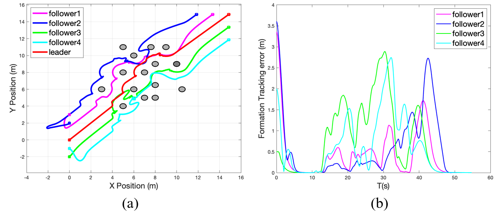

# Safe Distributed Learning-Enhanced Predictive Control for Multiple Quadrupedal Robots -- Policy training

### Introduction

For this project, you will run the codes in the MATLAB environment. The codes verify the convergence condition of our algorithm and the closed-loop stability condition for quadruped robot navigation, ensuring obstacle avoidance and formation stability.

  

### Running the code

- Run `main` to verify the safe navigation in obstacle dense environment.
- Run `MPC_CLF_CBF` to verify the convergence condition in the obstacle avoidance scenario.

