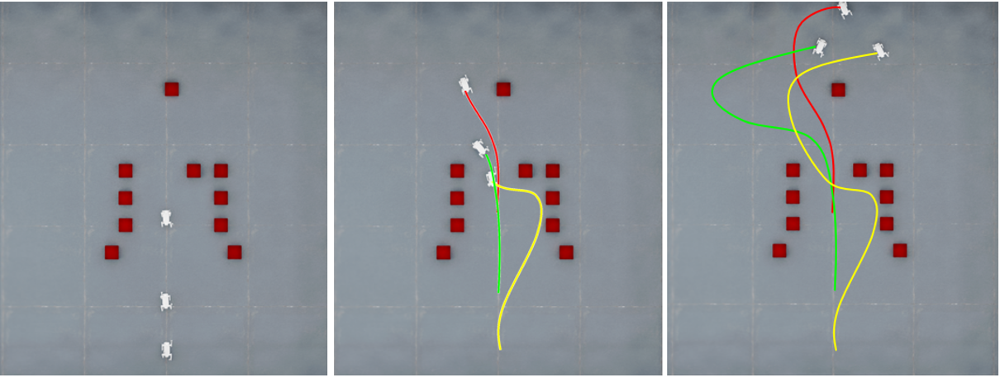

# Safe Distributed Learning-Enhanced Predictive Control for Multiple Quadrupedal Robots -- Simulated Experiments

### Introduction

The proposed planner has been evaluated in [NVIDIA Isaac_Sim](https://developer.nvidia.com/isaac/sim) and tested on our designed quadrupedal robot, XG, using a pre-trained RL locomotion policy from the Orbit Framework. A detailed guide on training and deploying the pre-trained RL locomotion policy, along with the USD file of our quadrupedal robot, is provided in an external document. Our hierarchical control architecture is implemented and trained within this simulated environment. We selected the NVIDIA warehouse environment (approximately 25 × 35m), where cuboid obstacles create narrow corridors. Our experiments focus on formation maintenance, collision avoidance, and deadlock resolution in these challenging scenarios.
<div align="center">
  
</div>

### Running the code

1. Copy the Python Files  
2. Open **Home** and enable hidden folders (if not already visible).  
3. Navigate to:  
```bash
Home/.local/share/ov/pkg/isaac-sim-4.20/extension_example
```

4. Locate and open **user_examples**.  
5. Copy and paste model file the Python files (__init__.py, Legged_Robot.py, Legged_Robot_extension.py) from **Isaacsim** into this directory.  

### Launch in Isaac Sim  
1. Start **Isaac Sim**.  
2. In the top-left menu, go to **Isaac Examples**.  
3. Select **Legged Robot**, then click **Load**.  

### train.py : The Python code for online training.

---

### References  
- [Isaac Sim Extension Templates](https://docs.omniverse.nvidia.com/isaacsim/latest/advanced_tutorials/tutorial_extension_templates.html)  
- [Isaac Sim Core API Tutorial - Hello World](https://docs.omniverse.nvidia.com/isaacsim/latest/core_api_tutorials/tutorial_core_hello_world.html)  

