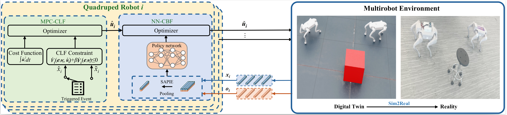

## MultiQuadruped-Control
In this paper proposes a distributed model predictive control framework for multi-quadruped formation control, integrating Control Lyapunov Functions to ensure formation stability and Control Barrier Functions for decentralized safety enforcement. To address the challenge of dynamically changing team structures, we introduce Scale Adaptive Permutation-Invariant Encoding (SAPIE), which enables robust feature encoding of neighboring robots while preserving permutation invariance. 

  

## Tutorials

This section provides a step-by-step guide to implementing the uploaded code.

### DMPC_training (Matlab)
This module verifies the **convergence condition** of our algorithm and ensures **closed-loop stability** for quadruped robot navigation. It focuses on:
- **Obstacle avoidance**
- **Formation stability**

The implementation is done in **Matlab**.

### IsaacSim (Python)
This module deploys the **control policy** to manage multiple quadruped robots in **IsaacSim**. It is based on our **XG quadrupedal robot platform** and includes materials related to the **XTDrone project**.

The implementation is done in **Python**.

---

## Dependencies

### DMPC_training (Matlab)
No additional dependencies are required. Ensure you have a compatible version of **Matlab**.

### IsaacSim (Python)
To set up the IsaacSim environment, please follow the official installation guide:
[IsaacSim Installation](https://docs.omniverse.nvidia.com/isaacsim/latest/overview.html).
