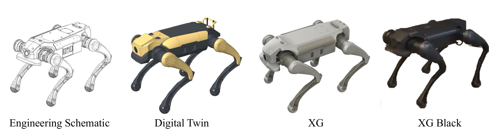

# RL_lab

[](https://docs.omniverse.nvidia.com/isaacsim/latest/overview.html)
[](https://isaac-sim.github.io/IsaacLab)
[](https://docs.python.org/3/whatsnew/3.10.html)
[](https://releases.ubuntu.com/20.04/)
[](https://www.microsoft.com/en-us/)
[](https://pre-commit.com/)
[](https://opensource.org/license/apache-2-0)

## Overview

**RL_lab** is an extension project based on Isaac Lab. It allows you to develop in an isolated environment, outside of the core Isaac Lab repository.

<div align="center">
  
</div>

## Installation

- Install Isaac Lab by following the [installation guide](https://isaac-sim.github.io/IsaacLab/source/setup/installation/index.html). We recommend using the conda installation as it simplifies calling Python scripts from the terminal.

- Clone the repository separately from the Isaac Lab installation (i.e. outside the `IsaacLab` directory):

  ```bash
  git clone https://github.com/YONEX4090/RL_lab.git
  ```

- Using a python interpreter that has Isaac Lab installed, install the library

  ```bash
  python -m pip install -e ./exts/RL_lab
  ```

- Verify that the extension is correctly installed by running the following command to print all the available environments in the extension:

  ```bash
  python scripts/tools/list_envs.py
  ```

<details>

<summary>Setup as Omniverse Extension (Optional, click to expand)</summary>

We provide an example UI extension that will load upon enabling your extension defined in `exts/RL_lab/RL_lab/ui_extension_example.py`. For more information on UI extensions, enable and check out the source code of the `omni.isaac.ui_template` extension and refer to the introduction on [Isaac Sim Workflows 1.2.3. GUI](https://docs.omniverse.nvidia.com/isaacsim/latest/introductory_tutorials/tutorial_intro_workflows.html#gui).

To enable your extension, follow these steps:

1. **Add the search path of your repository** to the extension manager:
    - Navigate to the extension manager using `Window` -> `Extensions`.
    - Click on the **Hamburger Icon** (☰), then go to `Settings`.
    - In the `Extension Search Paths`, enter the absolute path to `RL_lab/exts`
    - If not already present, in the `Extension Search Paths`, enter the path that leads to Isaac Lab's extension directory (`IsaacLab/source/extensions`)
    - Click on the **Hamburger Icon** (☰), then click `Refresh`.

2. **Search and enable your extension**:
    - Find your extension under the `Third Party` category.
    - Toggle it to enable your extension.

</details>

## Try examples

### Base Locomotion
DOG

```bash
# Train
python scripts/rsl_rl/base/train.py --task RLLab-Isaac-Velocity-Flat-DOG-v1 --headless
# Play
python scripts/rsl_rl/base/play.py --task RLLab-Isaac-Velocity-Flat-DOG-v1
```

FFTAI GR1T1

```bash
# Train
python scripts/rsl_rl/base/train.py --task RLLab-Isaac-Velocity-Flat-FFTAI-GR1T1-v0 --headless
# Play
python scripts/rsl_rl/base/play.py --task RLLab-Isaac-Velocity-Flat-FFTAI-GR1T1-v0
```

Anymal D

```bash
# Train
python scripts/rsl_rl/base/train.py --task RLLab-Isaac-Velocity-Flat-Anymal-D-v0 --headless
# Play
python scripts/rsl_rl/base/play.py --task RLLab-Isaac-Velocity-Flat-Anymal-D-v0
```

Unitree A1

```bash
# Train
python scripts/rsl_rl/base/train.py --task RLLab-Isaac-Velocity-Flat-Unitree-A1-v0 --headless
# Play
python scripts/rsl_rl/base/play.py --task RLLab-Isaac-Velocity-Flat-Unitree-A1-v0
```

Unitree Go2W (Unvalible for now)

```bash
# Train
python scripts/rsl_rl/base/train.py --task RLLab-Isaac-Velocity-Flat-Unitree-Go2W-v0 --headless
# Play
python scripts/rsl_rl/base/play.py --task RLLab-Isaac-Velocity-Flat-Unitree-Go2W-v0
```

Unitree H1

```bash
# Train
python scripts/rsl_rl/base/train.py --task RLLab-Isaac-Velocity-Flat-Unitree-H1-v0 --headless
# Play
python scripts/rsl_rl/base/play.py --task RLLab-Isaac-Velocity-Flat-Unitree-H1-v0
```

Unitree G1

```bash
# Train
python scripts/rsl_rl/base/train.py --task RLLab-Isaac-Velocity-Flat-Unitree-G1-v0 --headless
# Play
python scripts/rsl_rl/base/play.py --task RLLab-Isaac-Velocity-Flat-Unitree-G1-v0
```

The above configs are flat, you can change `Flat` to `Rough`

**Note**

* Record video of a trained agent (requires installing `ffmpeg`), add `--video --video_length 200`
* Play/Train with 32 environments, add `--num_envs 32`
* Play on specific folder or checkpoint, add `--load_run run_folder_name --checkpoint model.pt`
* Resume training from folder or checkpoint, add `--resume --load_run run_folder_name --checkpoint model.pt`

### AMP Locomotion

The code for AMP training refers to [AMP_for_hardware](https://github.com/Alescontrela/AMP_for_hardware)

Unitree A1

```bash
# Retarget motion files
python exts/RL_lab/RL_lab/third_party/amp_utils/scripts/retarget_kp_motions.py
# Replay AMP data
python scripts/rsl_rl/amp/replay_amp_data.py --task RLLab-Isaac-Velocity-Flat-Amp-Unitree-A1-v0
# Train
python scripts/rsl_rl/amp/train.py --task RLLab-Isaac-Velocity-Flat-Amp-Unitree-A1-v0 --headless
# Play
python scripts/rsl_rl/amp/play.py --task RLLab-Isaac-Velocity-Flat-Amp-Unitree-A1-v0
```

### HandStand

Supports four directions of handstand, use `handstand_type` in the configuration file to switch.

Unitree A1

```bash
# Train
python scripts/rsl_rl/base/train.py --task RLLab-Isaac-Velocity-Flat-HandStand-Unitree-A1-v0 --headless
# Play
python scripts/rsl_rl/base/play.py --task RLLab-Isaac-Velocity-Flat-HandStand-Unitree-A1-v0
```

## Add your own robot

For example, to generate DOG usd file:

```bash
python scripts/tools/convert_urdf.py a1.urdf exts/RL_lab/data/Robots/DOG/DOG.usd  --merge-join
```

Using the core framework developed as part of Isaac Lab, we provide various learning environments for robotics research.
These environments follow the `gym.Env` API from OpenAI Gym version `0.21.0`. The environments are registered using
the Gym registry.

Each environment's name is composed of `Isaac-<Task>-<Robot>-v<X>`, where `<Task>` indicates the skill to learn
in the environment, `<Robot>` indicates the embodiment of the acting agent, and `<X>` represents the version of
the environment (which can be used to suggest different observation or action spaces).

The environments are configured using either Python classes (wrapped using `configclass` decorator) or through
YAML files. The template structure of the environment is always put at the same level as the environment file
itself. However, its various instances are included in directories within the environment directory itself.
This looks like as follows:

```tree
exts/RL_lab/tasks/locomotion/
├── __init__.py
└── velocity
    ├── config
    │   └── DOG
    │       ├── agent  # <- this is where we store the learning agent configurations
    │       ├── __init__.py  # <- this is where we register the environment and configurations to gym registry
    │       ├── flat_env_cfg.py
    │       └── rough_env_cfg.py
    ├── __init__.py
    └── velocity_env_cfg.py  # <- this is the base task configuration
```

The environments are then registered in the `exts/RL_lab/tasks/locomotion/velocity/config/DOG/__init__.py`:

```python
gym.register(
    id="RLLab-Isaac-Velocity-Flat-DOG-v1",
    entry_point="omni.isaac.lab.envs:ManagerBasedRLEnv",
    disable_env_checker=True,
    kwargs={
        "env_cfg_entry_point": f"{__name__}.flat_env_cfg:DOGFlatEnvCfg",
        "rsl_rl_cfg_entry_point": f"{agents.__name__}.rsl_rl_ppo_cfg:DOGFlatPPORunnerCfg",
        "skrl_cfg_entry_point": f"{agents.__name__}:skrl_flat_ppo_cfg.yaml",
    },
)

gym.register(
    id="RLLab-Isaac-Velocity-Flat-DOG-Play-v1",
    entry_point="omni.isaac.lab.envs:ManagerBasedRLEnv",
    disable_env_checker=True,
    kwargs={
        "env_cfg_entry_point": f"{__name__}.flat_env_cfg:DOGFlatEnvCfg_PLAY",
        "rsl_rl_cfg_entry_point": f"{agents.__name__}.rsl_rl_ppo_cfg:DOGFlatPPORunnerCfg",
        "skrl_cfg_entry_point": f"{agents.__name__}:skrl_flat_ppo_cfg.yaml",
    },
)
```
